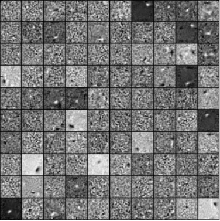
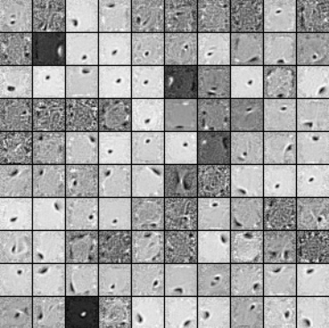
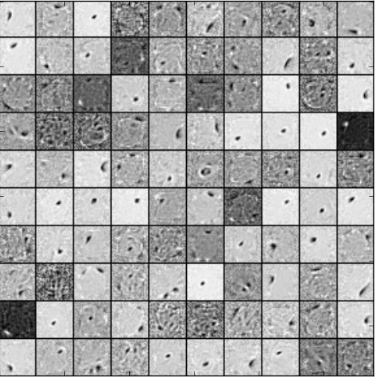
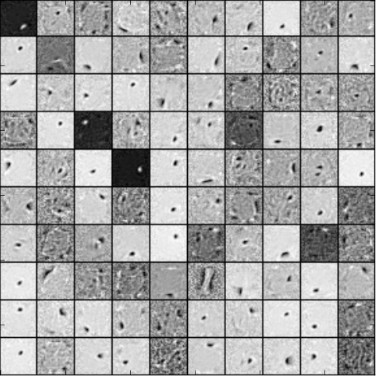

machine-learning
================

Migrate some of machine learning code from Dropbox to github, maybe also trying to write some useful packages.

# nn
* *ae.py*

Contains sparse autoencoder (*SAE*) and denoising autoencoder (*DAE*).

*SAE* is implemented with *lbfgs* as the training method, whereas *DAE* is trained with *sgd* (constant learning rate). They are easy to use (I think so ;P), you just specify the size of input and hidden layers and call *train* to start the training, I have some demo code in [test.py](nn/test.py) on MNIST dataset, here are some of the results of image filters.

Denoising autoencoder with *corruption level=0.0*:

Denoising autoencoder with *corruption level=0.3*:

Denoising autoencoder with *corruption level=0.3* and *untied weights*:

* *nn_layer.py, nn_net.py, nn_updater.py*

Meant to be written as the building blocks which can be used to construct easily configurable neural nets, still under construction. 

There is a demo which makes use of these building blocks to construct a denoising autoencoder, here is the results of image filters on MNIST dataset.

Denoising autoencoder constructed with nn building blocks, with *level=0.3* and *untied weights*:

