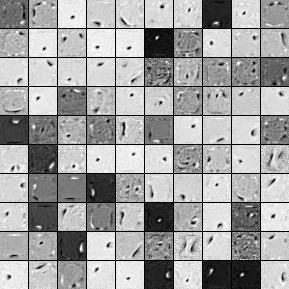
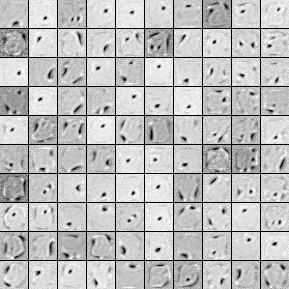

# nn_theano

Theano is good, but I'm not quite comfortable with Pylearn2, so trying to write an easily configurable neural net library.

Here are some simple examples using nn_theano, more details can be found in [test.py](test.py).

```python
# different kinds of layers
# 'full': FullConnectLayer, connection layer
# 'sigm': SigmoidLayer, activation layer
# 'deno': DenoisingLayer, just for denoising autoencoders
# 'drop': DropoutLayer, activation layer
# 'relu': ReLULayer, activation layer

'''
Construct a neural net via `Net`, to which the first arg is a list of lists, 
specifying the architecture with inside lists being specifics of each layer.

For example,
    [['full', 100, {}], ['sigm', 50, {}]]
specifies that 1st layer is a FullConnectLayer with 100 input size, 
and 2nd layer is a SigmoidLayer with 50 input size, more layer-specific args 
can be specified inside `{}`.

Note that, `Net` will find out the weight matrix shape of connection layer 
by combining the input sizes of these 2 adjacent layers.
'''

# Below is an example (taken from test.py) of building a denoising autoencoder

# load MNIST data
with open('../ufldl/data/mnist.pkl', 'rb') as fp:
        mnist = pickle.load(fp)

x = mnist[0][0].astype(np.float64)  # for training
x_v = mnist[1][0].astype(np.float64)  # for validation, optional

# define the neural net
net = Net([['deno', 28*28, {'level': 0.5, 'noise': 'binomial'}],
           ['full', 28*28, {}],
           ['sigm', 200, {}],
           ['full', 200, {}],
           ['sigm', 28*28, {}]],  # architecture

          loss_type='ceml',  # cross-entropy, multilabel Bernoulli

          updater_args={
            'base_lr': 0.1,  # base learning rate
            'l2_decay': 0.0,  # l2 regularization
            'tune_lr_type': 0,  # how to vary the learning rate as training preceeds
                                # here `0` means constant learning rate
            'update_type': 0  # how to update weights, 
                              # here `0` means no decay or momentum considered
          })

    print time.ctime()
    net.train(x, x, x_v_raw=x_v, y_v_raw=x_v, n_epochs=20, batch_size=20)
    print time.ctime()
    filters = tile_images(net.layers_[1].w_.get_value(),
                          (28, 28), (10, 10))
    save_image(filters, 'pic/dae.png')
```

Here are some images of filters learnt by the above denoising autoencoder.

Binomial noise (0.5):



Gaussian noise (0.5):


Binomial noise (0.5) with dropout (0.5) in hidden layer:


